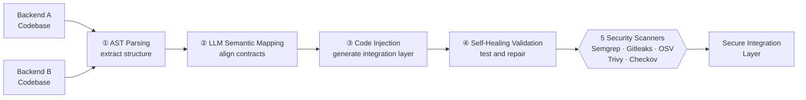
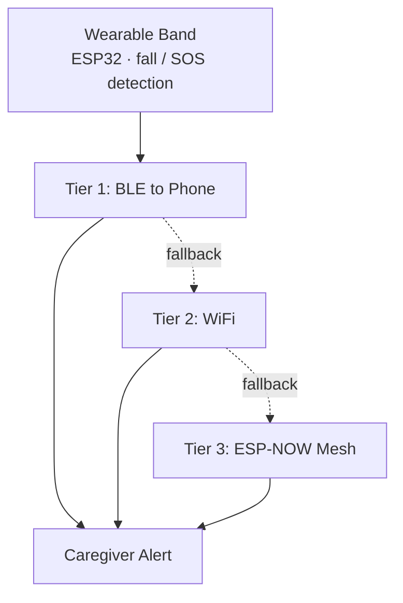

<!-- ═════════════════════════  HEADER  ═════════════════════════ -->
<div align="center">


<a href="https://github.com/vansh2K5">
  
</a>

<br/>

<a href="https://linkedin.com/in/vansh-jangra"></a>
<a href="mailto:vansh.jangra7@gmail.com"></a>
<a href="https://github.com/vansh2K5?tab=followers"></a>


</div>

<br/>

<!-- ═════════════════════════  ABOUT  ═════════════════════════ -->
## `> whoami`

```yaml
name:        Vansh Jangra
role:        Full-Stack Developer · Security Engineer · Systems Designer
education:   B.Tech CSIT (Cyber Security) @ Symbiosis Skills & Professional University
graduating:  2027
cgpa:        8.6
base:        Pune, India
currently:
  - Designing wearable IoT hardware for an eldercare startup (JeevanSetu)
  - Building CTF challenges & offensive-security scenarios (OffSecDiary)
  - Architecting LLM-driven code synthesis pipelines
philosophy:  "Build it. Break it. Secure it. Make it beautiful."
```

I design systems where **LLMs, static analysis, and security tooling work together**, then wrap them in interfaces that feel **cinematic** rather than clinical. I care about the full stack: firmware on an ESP32, a hardened Spring Boot API, a self-healing storage layer, or a WebGL scene that makes a network graph feel alive.

<br/>

<!-- ═════════════════════════  FOCUS  ═════════════════════════ -->
## `> focus_areas`

<table>
<tr>
<td width="33%" valign="top">

### 🧠 AI-Integrated Systems
LLM semantic mapping, AST parsing, and self-healing validation loops, applied to real engineering problems like auto-generating integration layers between codebases.

</td>
<td width="33%" valign="top">

### 🌐 Immersive 3D Web
React, TypeScript, and **React Three Fiber** interfaces that turn complex system state (like distributed node networks) into interactive 3D visuals.

</td>
<td width="33%" valign="top">

### 🛡️ Offensive & Secure Engineering
CTF design, auth-bypass and injection scenarios, business-logic exploits, and feeding findings back into **Secure SDLC** practice.

</td>
</tr>
</table>

<br/>

<!-- ═════════════════════════  TECH STACK  ═════════════════════════ -->
## `> tech_stack`

<div align="center">


<br/>

<br/>


</div>

| Layer | Stack |
|---|---|
| **Languages** | Java · Python · C++ · C · TypeScript · JavaScript |
| **Backend & Cloud** | Spring Boot · Node.js · Next.js · REST APIs · MySQL · MongoDB · Microsoft Azure |
| **Frontend / 3D** | React · Tailwind CSS · React Three Fiber |
| **Security & Compliance** | Secure SDLC · JWT/RBAC · Cryptography · Kali Linux · Nmap · Nessus · DPDP · PCI-DSS · GDPR · HIPAA *(applied)* |
| **Hardware & IoT** | ESP32 · BLE · WiFi Mesh (ESP-NOW) · Wokwi |
| **Core CS** | Data Structures · OOP · Computer Networks · System Design · Agile |

<br/>

<!-- ═════════════════════════  FEATURED PROJECTS  ═════════════════════════ -->
## `> featured_projects`

<table>
<tr>
<td width="50%" valign="top">

### 🧬 Automated Microservice Synthesis (AMS)
`AST Parsing` `LLM Semantic Mapping` `Security Scanning`

A **4-phase pipeline** that auto-generates the integration layer between two backend codebases, with code injection and self-healing validation. Every generated layer is scanned by **five security tools** (Semgrep, Gitleaks, OSV-Scanner, Trivy, Checkov) in a parallel, delta-scoped model.

</td>
<td width="50%" valign="top">

### 🌌 Symbiotic Chunk Storage (SCS)
`React` `TypeScript` `React Three Fiber` `Blockchain`

An **erasure-coded, self-healing distributed storage system** with automatic shard recovery via hash verification across independent nodes, a **Merkle-root blockchain anchoring** layer for tamper-evident proofs, and a **3D node-network visualization**.

</td>
</tr>
<tr>
<td width="50%" valign="top">

### 📅 Lightweight EMS
`Next.js` `TypeScript` `MongoDB` `Node.js` `JWT`

A real-time analytics and event management platform with **JWT-based Role-Based Access Control**, covering data modelling and APIs for multiple user roles across scheduling and reporting.

</td>
<td width="50%" valign="top">

### 📄 Document Upload Portal
`Spring Boot` `MySQL` `JPA` `REST API`

A secure, layered production backend for a live client: document upload, retrieval, and structured storage behind optimized REST APIs and a modular architecture.

</td>
</tr>
</table>

<details>
<summary><b>🔬 Peek inside AMS: the 4-phase pipeline</b></summary>
<br/>



</details>

<details>
<summary><b>⌚ Peek inside JeevanSetu: three-tier alert architecture</b></summary>
<br/>



</details>

<br/>

<!-- ═════════════════════════  EXPERIENCE  ═════════════════════════ -->
## `> experience.log`

| Period | Role | What I did |
|---|---|---|
| **Aug 2026 → Now** | **Hardware Design Contributor** · JeevanSetu *(sponsored, team of 4)* | Delivered two wearable prototypes for an eldercare startup; engineered a **three-tier alert architecture** (BLE → WiFi → ESP-NOW mesh); authored WiFi and **DPDP/HIPAA compliance** documentation. |
| **Jun 2026 → September 2026** | **CTF Developer Intern** · OffSecDiary | Built and hosted CTF challenges on intentionally vulnerable web apps across 5+ vulnerability classes: **auth bypass, injection, business-logic exploits**. |
| **Jun – Jul 2025** | **Software Development Intern** · Asmita Solutions | Built REST APIs and UI components with **Spring Boot, Angular, Ionic** and MySQL in an Agile team. |
| **Jun – Aug 2024** | **Cloud Computing Intern** · Yhills Ed.Tech | Hands-on with **Azure** compute, storage, and networking services. |

<br/>

<!-- ═════════════════════════  GITHUB STATS  ═════════════════════════ -->
## `> github_analytics`

<div align="center">


<br/><br/>


<br/><br/>


<br/><br/>


</div>

<br/>

<!-- ═════════════════════════  SNAKE  ═════════════════════════ -->
<div align="center">

<picture>
  <source media="(prefers-color-scheme: dark)" srcset="https://raw.githubusercontent.com/vansh2K5/vansh2K5/output/github-snake-dark.svg" />
  <source media="(prefers-color-scheme: light)" srcset="https://raw.githubusercontent.com/vansh2K5/vansh2K5/output/github-snake.svg" />
  
</picture>

</div>

<br/>

<!-- ═════════════════════════  EDUCATION  ═════════════════════════ -->
## `> education & certifications`

- 🎓 **B.Tech CSIT (Cyber Security)**, Symbiosis Skills and Professional University, Pune · *Expected 2027 · CGPA 8.6*
- 📜 **Supply Chain Analytics**, NPTEL (IIT/IISc initiative, Government of India) · 2026
- ☁️ **Cloud Computing Fundamentals**, Yhills Ed.Tech · 2024

<br/>

<!-- ═════════════════════════  CONTACT  ═════════════════════════ -->
## `> open_to`

```diff
+ DevSecOps / security-focused developer roles
+ AI-integrated systems and tooling
+ Immersive 3D web collaborations
+ CTF design & offensive-security education
```

<div align="center">

<br/>

**Let's build something that's secure, intelligent, and beautiful.**

<a href="https://linkedin.com/in/vansh-jangra"></a>
<a href="mailto:vansh.jangra7@gmail.com"></a>
<a href="https://github.com/vansh2K5"></a>


</div>
